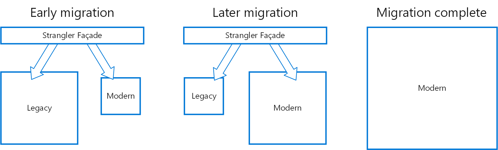

# 클라우드처럼 사용하는 온프레미스 - AWS의 클라우드와 온프레미스 통합 컨테이너 전략 알아보기



## 목차

1. 하이브리드 클라우드
2. AWS 하이브릴드 클라우드 옵션
   1. AWS Outposts
   2. ECS Anywhere
   3. EKS Anywhere
3. 마무리

## 하이브리드 클라우드?

고객의 환경에 따른 온프레미스 + 클라우드 복합적인 환경 구축

### 온프레미스 환경이 필요한 경우

1. 지연 시간에 민감한 App
2. 로컬에서 처리하는 것이 합리적인 경우
   1. 데이터 매우 많은 경우
3. 특정 국가나 규정에 의해서

<figure><figcaption></figcaption></figure>

Outposts 온프레미스에서 인프라와 서비스를 제공

Local은 로컬 서비스를 산업 센터와 가깝게 배포하기 위함

Wavelength sms 모바일과 연결될 때 추가 넹트워크 홉을 제공, 5G 엣지에서 속도 민감 요소 -> 서비스 및 도구 제공show, greengrace -&#x20;

**각 요소에 대해 내요을 찾아봐야 할 거 같음**

<figure><figcaption></figcaption></figure>

컨테이너를 이용하여 가장 간편하게 완전히 동일한 앱을 운영하도록 지원

<figure><figcaption></figcaption></figure>

<figure><figcaption></figcaption></figure>

오케스트레이터가 거의 반드시 필요 : 쿠버네티스 등

## 옵션

<figure><figcaption></figcaption></figure>

outpost 위에서 aws 서비스가 직접 실행됨

다양한 서비스를 아주 작은 지연시간을 가지고 운영됨

ECS Anywhere

온프레미스에서 자체적인 오케스트레이터가 없어도 됨

일관된 도구와 API 제공 - 클러스터 관리, 스케줄링, 모니터링 등과 같은 동일한 ECS 서비스 제공

관리부만 AWS 와 통신하며, 통신이 끊어져도 일관적인 서비스 제공

<figure><figcaption></figcaption></figure>

<figure><figcaption></figcaption></figure>

모든 컨테이너화 된 앱의 80% 이상이 EKS 에서 돌아감

일관된 환경으로 쿠버네티스를 실행하도록  EKS 제공

wavelength 존에서 EKS 실행 가능

EKS 배포 옵션의 근간에는 EKS Distro 가 있음 - EKS 가 사용하는 것과 동일한 쿠버네티스 배포판임

AWS 와 연결 없이 사용이 가능하며, 새 쿠버네티스 버전과 비교하여 업데이트됨

클라우드 기반의 EKS는 가장 안정적, 클라우드 기능 모두 활용 가능

주요 대도시 및 산업중심지에서 최종 사용자와 가까운 위치에서 하기위 해서는 wavelength, local zones 도 있음

Outpost 는 로컬 데이터존에서 실행 (로컬 클러스터와 확장 클러스터 배포 옵션)&#x20;

로컬 클러스터는 네트워크가 끊어져도 사용이 가능하도록 처리

확장 클러스터 옵션은 AWS 와 통신하기 때문에 리소스가 적으나, 네트워크 연결이 안정적이여야만 가능

디바이스에서 독립 시행 가능한 스노우볼 엣지 + EKS Anywhere

베어메탈 서버, 아파치, 등등에 대해 EKS Anywhere 사용 가능

EKS Anywhere

클러스터 설치를 단순화

EKS Distro 를 사용

클라우드와 달리 직접 관여하지 않음


ECS Anywhere 와 달리 EKS Anywhere의 제어부와 데이터부는 모두 온프레미스에 있음

ㅂ쿠버의 제한으로 제어부와 데이터부 ㅈ지연이 너무 크면 안되기 때문 - 네트워크가 끊겨도 사용 가능

하지만 클러스터 생성중에는 연결이 필요함

각 pod에서도 클라우드 서비스를 이용할 수 있도록 처리

OIDC 자격증명 또한 지원

하고자하는 서버의 OS 지원 여부 확인 필요 : 우분투, 레드헷 등을 지원

