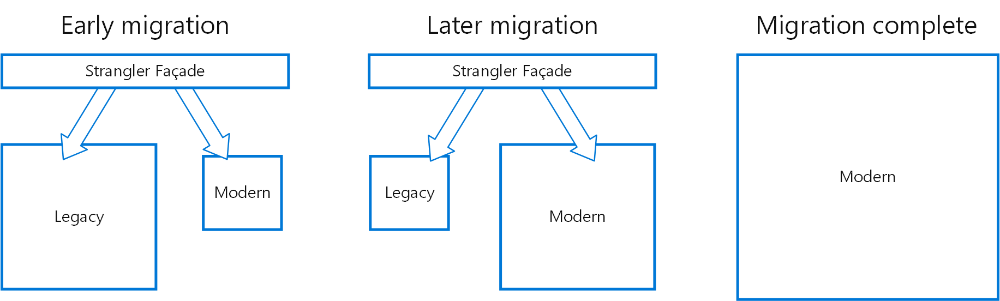

# Architecture Pattern



***

## Pacade Pattern

퍼사드 패턴.&#x20;

source

[https://refactoring.guru/ko/design-patterns/facade](https://refactoring.guru/ko/design-patterns/facade)

[https://ko.wikipedia.org/wiki/%ED%8D%BC%EC%82%AC%EB%93%9C\_%ED%8C%A8%ED%84%B4](https://ko.wikipedia.org/wiki/%ED%8D%BC%EC%82%AC%EB%93%9C\_%ED%8C%A8%ED%84%B4)

## Strangler Pattern&#x20;

<figure><figcaption></figcaption></figure>

주로 백엔드 어플리케이션을 점진적으로 마이그레이션 하는 데 많이 사용

**특정 부분의 기능**(주로 Service 단위)**을 별도의 어플리케이션으로 나눠, 새 시스템에 구성**

작업을 진행하면서 앞단에서(라우팅 단에서) 요청을 분배하여 처리 → tobe - asis 두 서버 모두 사용

점진적으로 분배된 어플리케이션을 tobe 서버로 이동시키게 되면서 마이그레이션 완료

* 장점
  * 지속적인 서비스 유지 가능
* 단점
  * 새 시스템과 레거시 시스템 간 공통적으로 사용하는 리소스(DB 등)에 나란히 엑세스가 가능한지 확인 필요
  * 기존 서비스가 모놀리식 서비스인 경우, 확인이 어려울 수 있음
  * 성능 병목 문제 생길 수 있음

source

[https://learn.microsoft.com/ko-kr/azure/architecture/patterns/strangler-fig](https://learn.microsoft.com/ko-kr/azure/architecture/patterns/strangler-fig)

[https://americanopeople.tistory.com/193](https://americanopeople.tistory.com/193)

